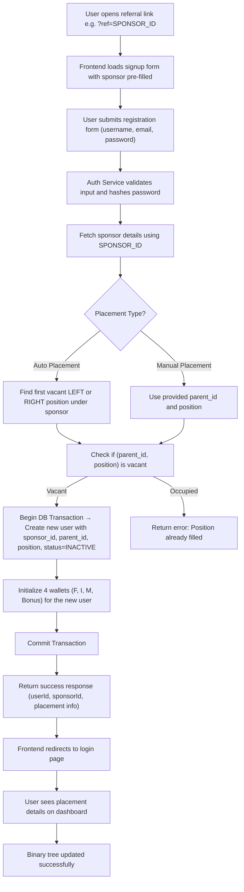
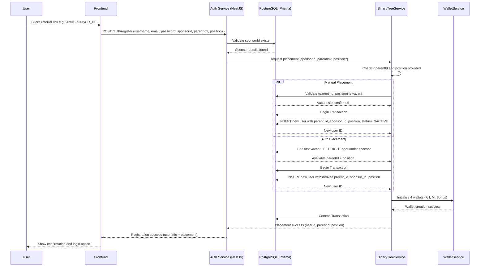

# 🧩 Binary Tree User Registration & Placement Flow

This document explains how a new user is registered and placed into the **binary tree** in our MLM financial system.  
It covers both **auto-placement** (system finds the next vacant position) and **manual placement** (user/upline chooses position).

---

## 1️⃣ Flowchart – Binary Tree Signup & Placement



---

## 2️⃣ Sequence Diagram – Signup (Auto + Manual Placement)



---

## 3️⃣ Explanation

### 🔹 Auto Placement

* Triggered when user registers via referral link only.
* The system finds the **next available LEFT or RIGHT** position under their sponsor.
* Prevents manual errors and ensures balanced binary tree growth.

### 🔹 Manual Placement

* Triggered when an existing member clicks a **vacant node** in their binary tree UI.
* The frontend sends `parentId` and `position` explicitly in the registration payload.
* The backend verifies that the spot is still vacant before creating the new user.

### 🔹 Transaction Handling

All user creation operations (including wallet initialization) occur inside a single **database transaction**:

* If any step fails (duplicate email, spot filled, DB issue), the transaction rolls back.
* Guarantees that no “half-created” user or wallet exists.

### 🔹 Wallet Initialization

Every new user gets 4 wallets automatically:

1. **F-Wallet** — Fund deposits.
2. **I-Wallet** — Income (referral, binary).
3. **M-Wallet** — ROI payouts from packages.
4. **Bonus Wallet** — Rank & rewards.

### 🔹 Data Constraints

Ensure data integrity:

```sql
CREATE UNIQUE INDEX unique_parent_position ON users(parent_id, position);
```

This prevents two members from being placed in the same left/right slot under a single parent.

---

## 4️⃣ Summary

| Step | Description                                   | Service            |
| ---- | --------------------------------------------- | ------------------ |
| 1    | User clicks referral link with sponsor ID     | Frontend           |
| 2    | User submits registration form                | Auth Service       |
| 3    | System validates sponsor and checks placement | BinaryTreeService  |
| 4    | New user created atomically with wallet setup | DB + WalletService |
| 5    | Success response sent to frontend             | Auth Service       |
| 6    | Binary tree view updated in dashboard         | Frontend           |

---

✅ **Next:**
After placement, package purchases trigger **BV propagation** up the tree and **binary income calculations**.
This will be detailed in the next document:
`binary-tree-bv-propagation.md`.
