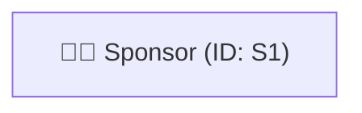
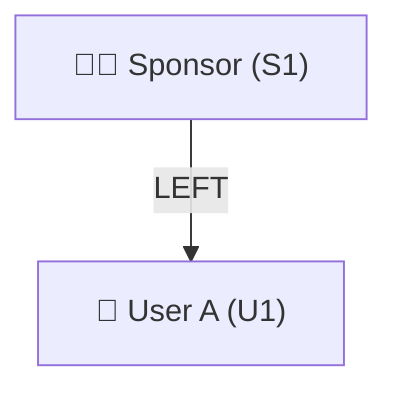
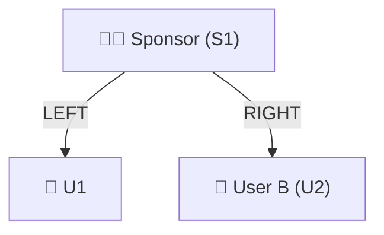
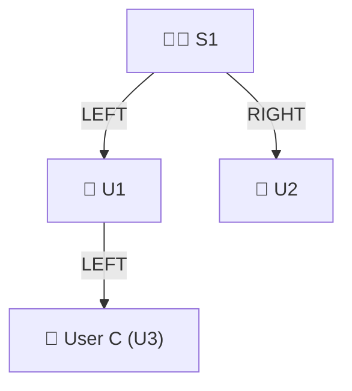
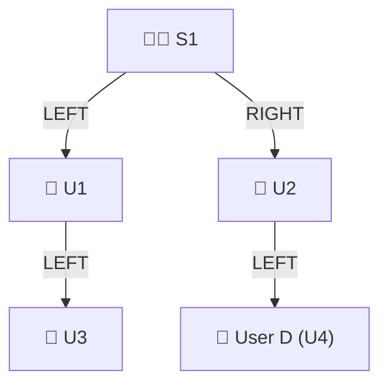
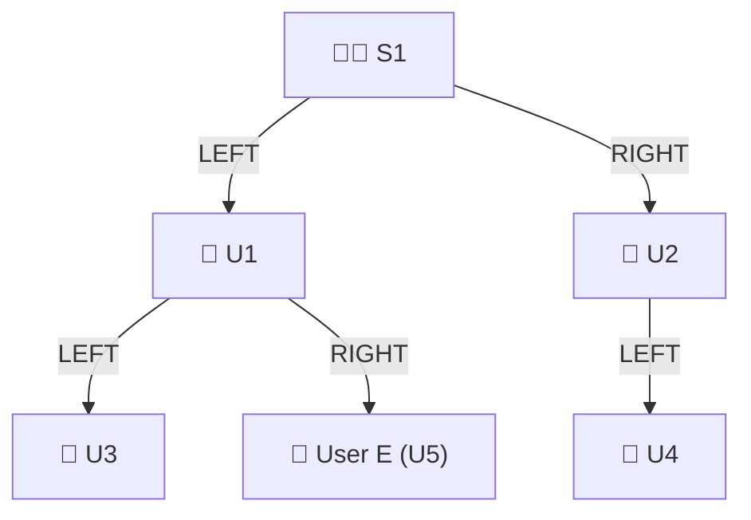
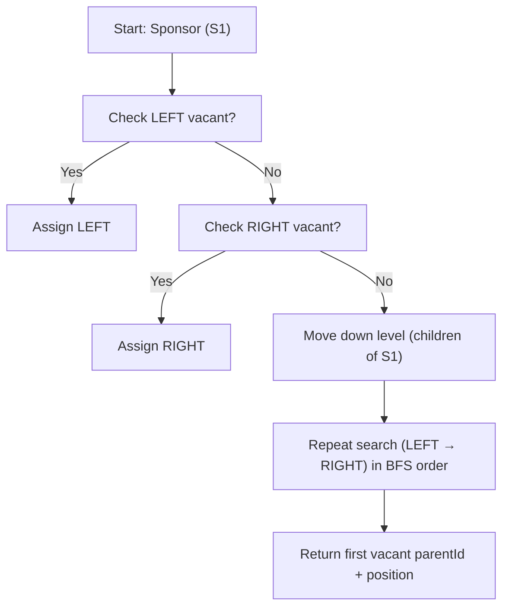
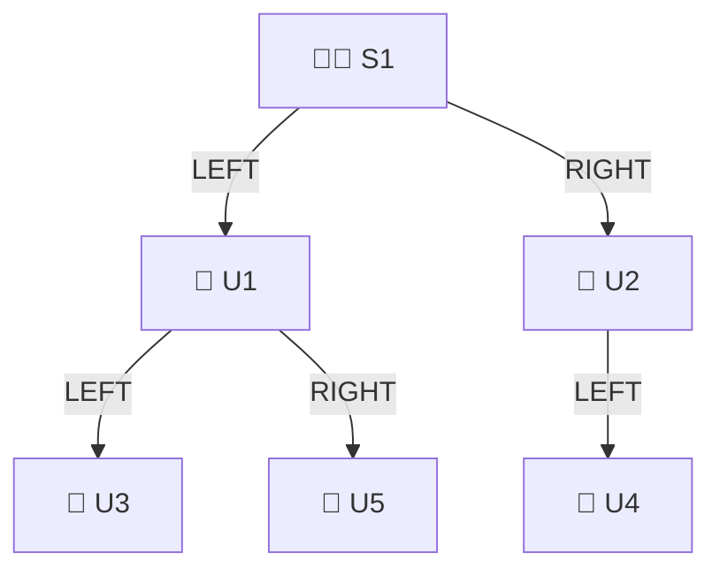

## 🌳 Binary Tree Creation — Step-by-Step Visualization

### 1️⃣ Initial Sponsor

At the start, there’s only **one sponsor** (the root node).

---

### 2️⃣ First Referral (Auto Placement → LEFT)

* **Trigger:** U1 signs up using S1’s referral link.
* **Placement type:** Auto
* **Action:** System finds the first vacant position under S1 → **LEFT**
* **Result:** U1 placed as **left child** of S1

---

### 3️⃣ Second Referral (Auto Placement → RIGHT)

* **Trigger:** U2 signs up via same sponsor (S1).
* **Placement type:** Auto
* **Action:** System finds next vacant position → **RIGHT**
* **Result:** U2 placed as **right child** of S1

---

### 4️⃣ Third Referral (Auto Placement → fills next available under U1)

* **Trigger:** U3 signs up via S1’s referral link.
* **Placement type:** Auto
* **Action:** S1’s direct positions (L/R) are full → system searches next available under U1.
* **Result:** U3 placed as **left child of U1**

---

### 5️⃣ Manual Placement Example

* **Trigger:** U2 manually selects a vacant position (LEFT) and invites U4.
* **Placement type:** Manual
* **Action:** Frontend sends `parentId=U2` & `position=LEFT`.
* **Result:** U4 placed under U2’s LEFT slot.

---

### 6️⃣ Continuing Tree Growth (Auto-Placement)

* **Trigger:** Next referral joins using S1’s link.
* **Placement type:** Auto
* **Action:** Finds next open slot in BFS order → **U1’s RIGHT**.
* **Result:** U5 placed under U1 → RIGHT.

---

### 🧩 Placement Search Logic (Auto Mode)

---

### 🏁 Final Structure (after 5 placements)

---

### 📘 Summary of Steps

| Step | User | Placement Type | Parent | Position |
| ---- | ---- | -------------- | ------ | -------- |
| 1    | U1   | Auto           | S1     | LEFT     |
| 2    | U2   | Auto           | S1     | RIGHT    |
| 3    | U3   | Auto           | U1     | LEFT     |
| 4    | U4   | Manual         | U2     | LEFT     |
| 5    | U5   | Auto           | U1     | RIGHT    |

---

### 💡 Tips for Doc Integration
